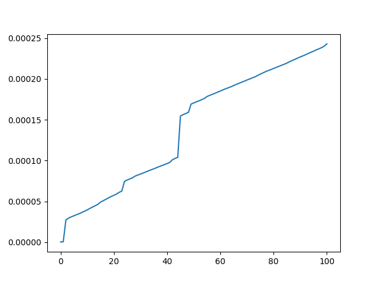

# spr cs3980 assignment 1

```bash
python3 -m venv venv
source ../.venv/bin/activate  or  . venv/bin/activate
pip3 install fastapi
pip3 install uvicorn
pip3 install functools
pip3 install matplotlib
```

After everything is looking good, for the assignment, I share all my pip installs in the requirements.txt file
```bash
pip3 freeze > requirements.txt
```


Here's my nice graph. It's a little wonky, but given that we're measuring in miniscules of seconds, the difference is likely just noise. Computers are quite fast, mine was able to calculate 100 iterations of the Fibonacci sequence within .0003 seconds.